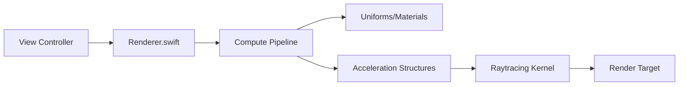

# SimpleEngine-RT Project Overview

SimpleEngine-RT is a modern, high-performance **Ray Tracing Engine** built using Apple's **Metal** framework. It leverages hardware-accelerated ray tracing (Ray Tracing Cores) to provide realistic lighting, reflections, and refractions in real-time.

---

## 🏗 System Architecture

The engine is built on a **split-responsibility architecture**:

1.  **Swift Layer (CPU)**: Manages scene data, handles user input (Camera), creates acceleration structures, and orchestrates the GPU execution.
2.  **Metal Layer (GPU)**: A compute-based pipeline that performs the heavy lifting: ray-triangle intersection, recursive light bouncing, and material shading.

### 🔄 Data Flow

---

## 🧩 Key Components

### 1. `Renderer.swift` (The Orchestrator)
The `Renderer` class is the heart of the engine. Its primary responsibilities include:
- **Pipeline Setup**: Compiles and links the `raytracing_kernel`.
- **Acceleration Structure (AS) Construction**:
    - **Primitive AS**: Built for each mesh (geometry).
    - **Instance AS**: Links multiple instances of meshes to a single "world" structure for fast traversal.
- **Resource Management**: Manages GPU buffers for vertices, indices, materials, and uniforms.
- **Command Dispatch**: Encodes and submits compute commands to the GPU every frame.

### 2. `Shaders.metal` (The Brain)
Contains the `raytracing_kernel`, which implements a **Path Tracing** approach:
- **Primary Rays**: Generates rays from the camera's position through each pixel.
- **Iterative Bouncing**: Instead of recursive calls (which are expensive on GPUs), it use a `for` loop (up to 6 bounces) to simulate light interactions.
- **Intersection Testing**: Uses the `intersector` object to query the Acceleration Structure.

### 3. `ShaderTypes.h` (The Bridge)
This header file is shared between Swift and Metal, ensuring that data structures like `RayUniforms` and `InstanceMaterial` have identical memory layouts on both the CPU and GPU.

---

## 🔦 Ray Tracing Technical Details

### 💎 Material Models
The engine supports three distinct material types:
- **Opaque**: Standard Lambertian shading with multi-light support.
- **Bulb (Emissive)**: Act as light sources, contributing to the `accum` (accumulation) buffer when hit.
- **Glass (Dielectric)**:
    - **Fresnel Reflection**: Uses the Schlick approximation to determine the ratio of reflected vs. refracted light based on the viewing angle.
    - **Snell's Law**: Precisely calculates the refraction vector as light enters or exits the glass.
    - **Beer-Lambert Law**: Simulates light absorption (tinting) as it travels through the medium.

### 🚀 Optimizations
- **Shadow Early-Out**: Uses `accept_any_intersection` for shadow rays. If the GPU finds *any* object between the surface and the light, it immediately marks it as "in shadow" without seeking the closest hit.
- **Argument Buffers**: Efficiently passes complex geometry data (vertex/index pointers) to the GPU.
- **ACES Tonemapping**: Applies a cinematic film-like curve to the final high-dynamic-range color values for a premium look.

---

## 🎮 Navigation & Controls
- **WASD**: Move horizontally.
- **Space / Left Control**: Move vertically.
- **Mouse Drag**: Rotate the camera.

---

> [!TIP]
> To modify the scene's behavior (e.g., increase light bounces or change ambient values), look at the `constant` declarations at the top of `Shaders.metal`.
